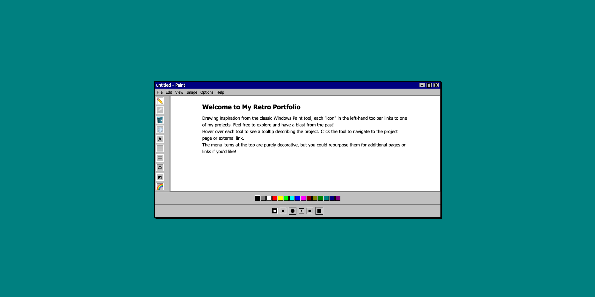

# Paint Portfolio 🎨

A nostalgic Windows 95-style paint application that doubles as an interactive portfolio. This project combines the classic look and feel of Microsoft Paint with modern web technologies to create an engaging and memorable portfolio experience.



## Features ✨

- **Classic Windows 95 UI**: Authentic look and feel with title bar, menu, and toolbars
- **Interactive Drawing Tools**:
  - Pencil tool
  - Eraser
  - Fill tool
  - Airbrush
  - Text tool
  - Line tool
  - Rectangle
  - Ellipse
  - Rounded Rectangle
  - Color Picker
- **Color Palette**: 16 classic Windows 95 colors
- **Brush Size Options**: Multiple sizes for both circle and square brushes
- **Responsive Design**: Adapts to different screen sizes
- **Portfolio Integration**: Each tool can be linked to a project or external resource

## Getting Started 🚀

1. Clone the repository:
   ```bash
   git clone https://github.com/yourusername/paint-portfolio.git
   ```

2. Open `index.html` in your web browser:
   ```bash
   open index.html
   ```

## Deployment 🌐

This project is set up for automatic deployment to GitHub Pages. The site will be available at:
`https://yourusername.github.io/paint-portfolio/`

### Manual Deployment
1. Push your changes to the main branch
2. GitHub Actions will automatically deploy to GitHub Pages
3. Wait a few minutes for the deployment to complete

### Custom Domain
1. Add your domain to the `CNAME` file
2. Configure DNS settings with your domain provider
3. Update the `robots.txt` and `sitemap.xml` with your custom domain

## Usage Guide 📝

### Drawing Tools
- Click on any tool in the left toolbar to select it
- Use the color palette at the bottom to change colors
- Select brush size and shape from the bottom controls
- Draw on the canvas by clicking and dragging

### Portfolio Navigation
- Hover over tools to see project descriptions
- Click on tools to navigate to project pages
- Use the menu items for additional navigation (customizable)

### Window Controls
- Minimize: Minimizes the window (decorative)
- Maximize: Maximizes the window (decorative)
- Clear Canvas: Clears the drawing area

## Customization 🛠️

### Adding Projects
1. Edit the tool links in the toolbar section:
   ```html
   <a href="your-project-url" class="tool" data-label="Your Project" data-tool="your-tool">🔧</a>
   ```

2. Update the tooltip text in the `data-label` attribute

### Changing Colors
1. Modify the color swatches in the color palette:
   ```html
   <div class="color-swatch" style="background-color: #your-color" data-color="#your-color"></div>
   ```

### Customizing Menu Items
1. Update the menu bar items:
   ```html
   <div class="menu-bar">
     <span>Your Menu Item</span>
     <!-- Add more items -->
   </div>
   ```

## Browser Compatibility 🌐

- Chrome (latest)
- Firefox (latest)
- Safari (latest)
- Edge (latest)

## Contributing 🤝

Contributions are welcome! Please feel free to submit a Pull Request.

## License 📄

This project is licensed under the MIT License - see the [LICENSE](LICENSE) file for details.

## Acknowledgments 🙏

- Inspired by the classic Microsoft Paint application
- Uses modern web technologies to recreate the Windows 95 experience
- Special thanks to the open-source community for tools and resources

---

Made with ❤️ by [Your Name] 
